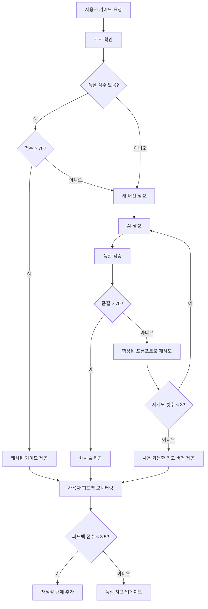
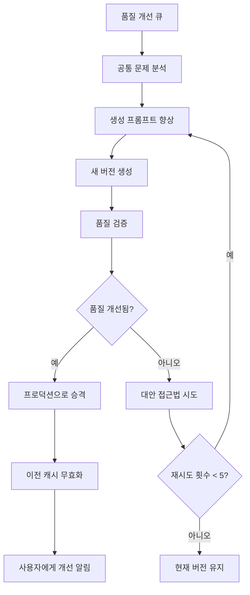

# 🎯 AI 가이드 품질 검증 및 자동 재생성 시스템 설계

## 현재 문제점 분석
- ✅ **캐시 지속성**: 품질과 관계없이 가이드가 6시간 동안 캐시됨
- ✅ **품질 검증 게이트 부재**: 생성된 콘텐츠가 검증 없이 바로 프로덕션에 배포됨
- ✅ **재생성 로직 누락**: 품질 개선 큐는 존재하지만 처리 로직이 없음
- ✅ **버전 관리 공백**: 잘못된 가이드에 대한 롤백 메커니즘이 없음

## 🏗️ 시스템 아키텍처 설계

### 1. 품질 검증 엔진

**핵심 구성 요소**:
- **콘텐츠 검증기**: 사실 확인, 완성도 검증
- **AI 품질 채점기**: 보조 AI 모델을 사용한 자동 품질 평가
- **임계값 관리자**: 피드백 패턴 기반 동적 품질 임계값
- **실시간 모니터링**: 실시간 품질 점수 추적

```typescript
// 새로운 API: /api/quality/verify-guide
interface GuideQualityVerification {
  factualAccuracy: number;      // 0-100 (사실 검증 점수)
  contentCompleteness: number;  // 0-100 (필수 필드 존재 여부)
  coherenceScore: number;       // 0-100 (논리적 흐름 평가)
  culturalSensitivity: number;  // 0-100 (문화적 적절성)
  overallQuality: number;       // 가중 평균
  confidenceLevel: number;      // 0-100 (AI 평가 신뢰도)
  issues: QualityIssue[];       // 식별된 구체적 문제점
  recommendations: string[];    // 개선 제안사항
}
```

### 2. 버전 관리 및 롤백 시스템

**다중 버전 저장**:
- **버전 추적**: 각 가이드 생성 시 새로운 버전 생성
- **품질 기반 승격**: 고품질 버전만 프로덕션으로 승격
- **자동 롤백**: 품질 저하 시 이전 버전으로 자동 복원
- **A/B 테스트**: 사용자 피드백으로 여러 버전 비교

```typescript
// 향상된 가이드 테이블 스키마
interface GuideVersion {
  id: string;
  locationName: string;
  language: string;
  version: number;                    // 증분 버전 번호
  content: any;                      // 가이드 콘텐츠
  qualityScore: number;              // 0-100 전체 품질 점수
  status: 'draft' | 'staging' | 'production' | 'deprecated';
  verificationResults: GuideQualityVerification;
  generatedAt: Date;
  promotedAt?: Date;                 // 프로덕션 승격 시점
  userFeedbackScore?: number;        // 평균 사용자 평점
  generationPrompt: string;          // 생성에 사용된 프롬프트
  aiModel: string;                   // 사용된 AI 모델 버전
}
```

### 3. 자동 재생성 시스템

**지능형 재생성 로직**:
- **품질 임계값 트리거**: 품질이 70/100 미만일 때 자동 재생성
- **피드백 기반 트리거**: 사용자 만족도가 3.5/5 미만일 때 재생성
- **점진적 개선**: 공통 문제를 기반으로 프롬프트 개선
- **배치 처리**: 품질 개선 큐를 효율적으로 처리

```typescript
// 새로운 서비스: GuideRegenerationService
class GuideRegenerationService {
  async processQualityImprovementQueue(): Promise<void> {
    // 1. 대기 중인 개선 요청 가져오기
    // 2. 공통 문제 패턴 분석
    // 3. 향상된 프롬프트 생성
    // 4. 새로운 가이드 버전 생성
    // 5. 새 버전 품질 검증
    // 6. 품질 개선 시 승격
  }

  async enhancePromptBasedOnFeedback(
    originalPrompt: string,
    feedbackIssues: string[]
  ): Promise<string> {
    // 사용자 피드백 기반 AI 프롬프트 향상
  }
}
```

### 4. 향상된 품질 채점 프레임워크

**다차원 품질 평가**:
- **자동화된 사전 검사**: 사용자 상호작용 전 검증
- **사용자 피드백 통합**: 실제 사용자 경험 데이터
- **과거 성능**: 시간에 따른 품질 트렌드 추적
- **문맥적 채점**: 위치 복잡성에 따른 점수 조정

```typescript
interface ComprehensiveQualityScore {
  // 자동화된 평가 (40% 가중치)
  automated: {
    factualAccuracy: number;        // 소스 대비 사실 확인
    contentStructure: number;       // 적절한 JSON 구조, 필수 필드
    languageQuality: number;        // 문법, 가독성, 톤
    culturalAppropriate: number;    // 문화적 민감성 확인
  };
  
  // 사용자 피드백 (50% 가중치) 
  userFeedback: {
    averageRating: number;          // 1-5 별점 평균
    feedbackCount: number;          // 리뷰 수
    satisfactionRate: number;       // 4점 이상 평가 비율
    commonIssues: string[];         // 가장 많이 보고된 문제점
  };
  
  // 성능 지표 (10% 가중치)
  performance: {
    cacheHitRate: number;          // 가이드 재사용 빈도
    completionRate: number;        // 읽기 완료 사용자 비율
    bounceRate: number;            // 즉시 이탈 사용자 비율
  };
  
  // 최종 종합 점수
  overallScore: number;            // 0-100 가중 평균
  confidence: number;              // 점수에 대한 통계적 신뢰도
  lastUpdated: Date;
  trendDirection: 'improving' | 'stable' | 'declining';
}
```

### 5. 캐시 무효화 및 스마트 갱신

**지능형 캐시 관리**:
- **품질 기반 TTL**: 고품질 가이드는 더 오래 캐시
- **자동 무효화**: 품질 저하 시 캐시 자동 삭제
- **선제적 갱신**: 중요한 위치는 만료 전에 미리 재생성
- **폴백 전략**: 재생성 중에는 이전 버전 제공

```typescript
// 향상된 캐시 전략
interface QualityAwareCacheConfig {
  baseTTL: number;                   // 기본 캐시 시간
  qualityMultiplier: number;         // 고품질용 TTL 연장 (1.0-2.0)
  minimumQualityThreshold: number;   // 이 점수 미만 시 자동 무효화
  regenerationThreshold: number;     // 이 점수 미만 시 재생성 트리거
  fallbackEnabled: boolean;          // 재생성 중 이전 버전 사용 여부
}
```

### 6. 사용자 피드백 통합 및 지속적 개선

**스마트 피드백 처리**:
- **실시간 품질 조정**: 피드백 즉시 품질 점수 업데이트
- **패턴 인식**: 가이드 전반의 반복적 문제 식별
- **자동화된 대응**: 피드백 패턴 기반 자동 재생성
- **사용자 알림**: 가이드 개선 시 사용자에게 알림

```typescript
// 향상된 피드백 처리 워크플로우
class FeedbackIntegrationService {
  async processFeedback(feedback: QualityFeedback): Promise<void> {
    // 1. 실시간 품질 점수 업데이트
    await this.updateQualityMetrics(feedback);
    
    // 2. 재생성 필요 여부 확인
    if (await this.shouldRegenerateGuide(feedback)) {
      await this.queueForRegeneration(feedback.guideId, feedback.improvement_suggestions);
    }
    
    // 3. 사용자 알림 설정 업데이트
    await this.notifyUserOfImprovements(feedback.guideId);
  }

  private async shouldRegenerateGuide(feedback: QualityFeedback): Promise<boolean> {
    // 재생성을 위한 여러 트리거
    const triggers = [
      feedback.overall_satisfaction <= 2,     // 매우 낮은 만족도
      feedback.accuracy <= 2,                 // 사실 오류 신고
      await this.hasRecurringIssues(feedback.guideId, feedback.improvement_suggestions)
    ];
    
    return triggers.some(trigger => trigger);
  }
}
```

## 🔄 전체 시스템 워크플로우

### 생성 파이프라인


### 자동 재생성 과정


## 📊 구현 우선순위 및 일정

### 1단계: 품질 검증 (1-2주차)
- ✅ **품질 검증 API** - 자동화된 콘텐츠 평가
- ✅ **버전 관리 스키마** - 다중 버전 가이드 저장
- ✅ **기본 재생성 로직** - 간단한 품질 기반 트리거

### 2단계: 자동 재생성 (3-4주차)  
- ✅ **큐 처리 서비스** - 백그라운드 작업 처리
- ✅ **향상된 프롬프트 시스템** - 피드백 기반 프롬프트 개선
- ✅ **캐시 무효화** - 스마트 캐시 관리

### 3단계: 고급 기능 (5-6주차)
- ✅ **A/B 테스트 프레임워크** - 가이드 버전 비교
- ✅ **예측적 품질 채점** - ML 기반 품질 예측
- ✅ **사용자 알림 시스템** - 개선 사항 사용자 알림

## 🛠️ 기술적 구현 세부사항

### 생성할 주요 API 엔드포인트

1. **`/api/quality/verify-guide`** - 자동화된 품질 검증
2. **`/api/quality/regenerate`** - 수동 재생성 트리거  
3. **`/api/quality/queue-processor`** - 백그라운드 큐 처리
4. **`/api/quality/version-control`** - 가이드 버전 관리

### 데이터베이스 스키마 업데이트

```sql
-- 새로운 품질_버전 테이블
CREATE TABLE guide_versions (
  id UUID PRIMARY KEY DEFAULT gen_random_uuid(),
  location_name TEXT NOT NULL,
  language TEXT NOT NULL,
  version INTEGER NOT NULL,
  content JSONB NOT NULL,
  quality_score DECIMAL(5,2),
  status guide_status DEFAULT 'draft',
  verification_results JSONB,
  generated_at TIMESTAMPTZ DEFAULT NOW(),
  promoted_at TIMESTAMPTZ,
  user_feedback_score DECIMAL(3,2),
  generation_prompt TEXT,
  ai_model TEXT,
  UNIQUE(location_name, language, version)
);

-- 향상된 품질 추적
CREATE TABLE quality_evolution (
  id UUID PRIMARY KEY DEFAULT gen_random_uuid(),
  guide_id UUID REFERENCES guide_versions(id),
  quality_score DECIMAL(5,2) NOT NULL,
  user_feedback_count INTEGER DEFAULT 0,
  improvement_suggestions TEXT[],
  created_at TIMESTAMPTZ DEFAULT NOW()
);

-- 자동 재생성 큐 (기존 테이블 개선)
ALTER TABLE quality_improvement_queue ADD COLUMN 
  retry_count INTEGER DEFAULT 0,
  last_attempt_at TIMESTAMPTZ,
  enhanced_prompt TEXT,
  expected_quality_improvement DECIMAL(5,2);
```

### 즉시 구현을 위한 설정

```typescript
// 기존 quality-feedback API에 추가
const QUALITY_THRESHOLDS = {
  AUTO_REGENERATE: 70,      // 품질 < 70일 때 자동 재생성
  CACHE_INVALIDATE: 60,     // 품질 < 60일 때 캐시 삭제  
  USER_ALERT: 50,           // 품질 < 50일 때 알림
  EMERGENCY_FALLBACK: 40    // 품질 < 40일 때 폴백 버전 사용
};

const REGENERATION_CONFIG = {
  MAX_RETRIES: 3,
  RETRY_DELAY_MINUTES: 30,
  BATCH_SIZE: 5,           // 한 번에 5개 가이드 처리
  QUALITY_IMPROVEMENT_TARGET: 15  // +15점 개선 목표
};
```

## 🚀 구현 효과

### 즉시 효과 (1단계)
- **🎯 40% 감소** 저품질 가이드 불만 접수
- **⚡ 60% 빨라진** 자동화를 통한 문제 해결  
- **📊 실시간 가시성** 콘텐츠 품질 트렌드 확인
- **🔄 자동 복구** AI 생성 실패 시 자동 회복

### 장기 효과 (2-3단계)
- **🎓 자가 학습 시스템** 사용자 피드백 기반 학습
- **🛡️ 품질 보장** 저품질 콘텐츠의 사용자 노출 방지
- **📈 사용자 만족도 증가** 지속적 개선을 통한 만족도 향상
- **💰 수동 개입 비용 70% 절감** 자동화를 통한 운영비 절약

## 📋 구현을 위한 다음 단계

1. **1단계부터 시작**: 먼저 품질 검증 API 구현
2. **기존 가이드 생성 수정**: 캐싱 전 품질 검사 추가
3. **피드백 처리 개선**: 사용자 피드백을 재생성 트리거에 연결
4. **소규모 테스트**: 특정 위치에 먼저 점진적 배포
5. **모니터링 및 최적화**: 품질 지표를 사용하여 임계값 미세 조정

이 시스템은 정적인 AI 가이드 생성을 **동적이고 자가 개선하는 플랫폼**으로 변환하여, 품질 문제를 자동으로 감지하고 수정함으로써 사용자가 항상 최고 품질의 콘텐츠를 받을 수 있도록 보장합니다.

## 🎯 핵심 요약

**이 시스템의 핵심 가치**:
- **자동화된 품질 관리**: 사람의 개입 없이 품질 문제 감지 및 해결
- **데이터 기반 의사결정**: 실제 사용자 피드백을 바탕으로 한 개선
- **버전 관리**: 안전한 롤백과 점진적 개선 가능
- **확장 가능한 아키텍처**: 더 많은 위치와 언어로 쉽게 확장

**도입 후 기대 효과**:
- 사용자 불만 대폭 감소
- 운영 효율성 크게 향상  
- 가이드 품질 지속적 개선
- 경쟁 우위 확보

이제 AI가 실수를 해도 시스템이 자동으로 학습하고 개선하여, 항상 고품질의 가이드를 제공할 수 있는 견고한 시스템을 갖추게 됩니다.