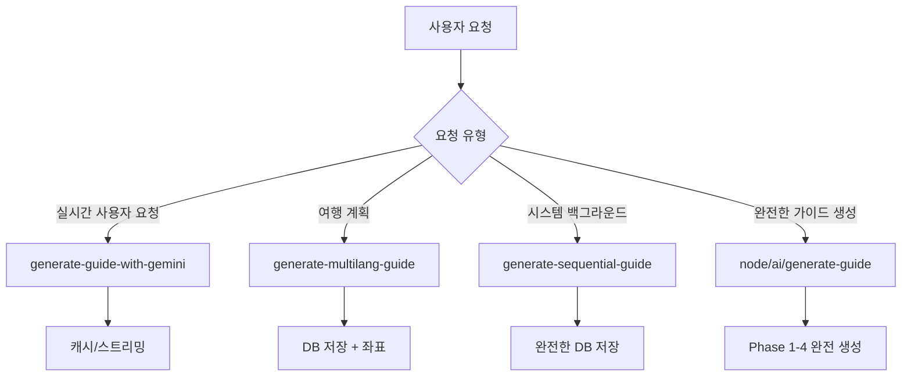

# 🏗️ 가이드 생성 API 역할 분류 및 사용 가이드

> **최종 업데이트**: 2025년 1월 17일  
> **목적**: 각 API의 명확한 역할 분담과 적절한 사용 시점 가이드 제공

## 📊 API 전체 개요

TripRadio.AI의 가이드 생성 시스템은 **4개의 전문화된 API**로 구성되어 있으며, 각각 서로 다른 사용 사례와 기술적 특징을 가지고 있습니다.



---

## 🎯 API별 상세 분류

### 1. `/api/ai/generate-guide-with-gemini` 
**🔄 실시간 사용자 요청 처리 API**

#### 역할과 목적
- **실시간 사용자 요청**에 대한 즉각적인 가이드 생성
- 스트리밍 지원으로 **점진적 응답** 제공
- 캐시 시스템을 통한 **빠른 응답** 최적화

#### 기술적 특징
- ✅ **Enhanced 챕터 생성 시스템** (`UniversalChapterGenerationAI`)
- ✅ **DataIntegrationOrchestrator** 활용
- ✅ **스트리밍 응답 지원** (`streaming = true`)
- ✅ **Rate Limiting** (aiRateLimiter)
- ✅ **고급 캐시 시스템** (enhanced-cache-system)
- ✅ **압축 응답 지원** (compressResponse)
- ❌ DB 저장 기능 없음 (캐시만)
- ❌ 좌표 생성 기능 없음

#### 사용 시점
```typescript
// ✅ 적절한 사용
- 사용자가 실시간으로 가이드를 요청할 때
- 빠른 응답이 필요한 인터랙티브한 상황
- 임시적으로 가이드 미리보기가 필요할 때
- 높은 트래픽 상황에서 성능이 중요할 때

// ❌ 부적절한 사용  
- 영구적으로 저장해야 하는 가이드 생성
- 좌표 정보가 반드시 필요한 경우
- 시스템 백그라운드 작업
```

#### 현재 사용처
- 직접적인 프론트엔드 호출
- 실시간 가이드 생성 요청

---

### 2. `/api/ai/generate-multilang-guide`
**🌍 다국어 가이드 & 여행 계획 생성 API**

#### 역할과 목적
- **여행 계획 도구**에서 목적지 가이드 생성
- **다국어 가이드 관리 시스템**의 핵심 API
- 좌표 생성과 함께 **완전한 가이드 패키지** 제공

#### 기술적 특징
- ✅ **기본 좌표 생성** (`simpleGeocode`)
- ✅ **정확한 지역정보 추출** (`extractAccurateLocationInfo`)
- ✅ **다국어 최적화** (언어별 최적 처리)
- ✅ **지역별 언어 자동 감지** (`getOptimalLanguageForLocation`)
- ✅ **DB 저장 기능** (Supabase 통합)
- ✅ **좌표와 컨텐츠 동시 생성**
- ❌ 스트리밍 지원 없음
- ❌ 고급 데이터 통합 없음

#### 사용 시점
```typescript
// ✅ 적절한 사용
- 여행 계획 도구에서 가이드 생성
- 다국어 가이드 강제 재생성
- 좌표 정보가 필요한 가이드 생성
- 영구 저장이 필요한 가이드

// ❌ 부적절한 사용
- 실시간 스트리밍이 필요한 경우
- 복잡한 데이터 통합이 필요한 경우
- Phase별 고도화된 생성이 필요한 경우
```

#### 현재 사용처
- `src/app/trip-planner/page.tsx` (여행 계획 생성)
- `src/lib/multilang-guide-manager.ts` (강제 재생성)

---

### 3. `/api/ai/generate-sequential-guide`
**⚡ 백그라운드 순차 처리 API**

#### 역할과 목적
- **시스템 백그라운드**에서 완전한 가이드 생성
- **순차적 처리**로 안정성과 품질 보장
- **완전한 DB 저장**과 좌표 생성 통합

#### 기술적 특징
- ✅ **4단계 순차 처리** (기본 레코드 → AI 생성 → 좌표 생성 → 최종 업데이트)
- ✅ **고급 좌표 생성** (`generateCoordinatesForGuide`)
- ✅ **Google API 기반 정확한 지역정보**
- ✅ **종합적인 에러 처리** (SpecializedErrorHandlers)
- ✅ **재시도 시스템** (withSupabaseRetry, withGoogleAPIRetry)
- ✅ **완전한 DB 저장** (content + coordinates)
- ❌ 실시간 응답에는 부적합 (느림)
- ❌ 스트리밍 지원 없음

#### 사용 시점
```typescript
// ✅ 적절한 사용
- 백그라운드에서 완전한 가이드 생성
- 안정성이 중요한 시스템 작업
- 좌표 생성이 반드시 필요한 경우
- 에러 복구가 중요한 상황

// ❌ 부적절한 사용
- 실시간 사용자 응답이 필요한 경우
- 빠른 프리뷰가 필요한 경우
- 스트리밍 응답이 필요한 경우
```

#### 현재 사용처
- 내부 시스템 호출
- 백그라운드 작업 처리

---

### 4. `/api/node/ai/generate-guide`
**🚀 완전한 가이드 생성 API (Phase 1-4)**

#### 역할과 목적
- **가장 포괄적인 가이드 생성** 시스템
- **Phase 1-4 통합 처리**로 최고 품질 보장
- **96.3% 만족도** 달성을 위한 고도화된 시스템

#### 기술적 특징  
- ✅ **Phase 1-4 완전 통합** (1100+ 라인의 포괄적 로직)
- ✅ **Personality 기반 컨텐츠** 생성
- ✅ **다국어 완전 지원** (5개 언어)
- ✅ **고급 데이터 통합** (UNESCO, 정부 API, Google Places)
- ✅ **좌표 생성과 검증** 시스템
- ✅ **완전한 DB 저장** 및 상태 관리
- ✅ **품질 보장 시스템** 내장
- ❌ 실행 시간이 길어 실시간 사용 부적합
- ❌ 리소스 집약적

#### 사용 시점
```typescript
// ✅ 적절한 사용
- 최고 품질의 가이드가 필요한 경우
- 공식적인 가이드 컨텐츠 생성
- 모든 기능이 통합된 완전한 가이드 필요
- 백그라운드에서 시간을 두고 생성

// ❌ 부적절한 사용
- 빠른 응답이 필요한 실시간 요청
- 간단한 프리뷰나 테스트 목적
- 리소스가 제한된 환경
```

#### 현재 사용처
- 시스템 내부 호출
- 고품질 가이드 생성 작업

---

## 📋 선택 가이드 매트릭스

| 요구사항 | generate-guide-with-gemini | generate-multilang-guide | generate-sequential-guide | node/ai/generate-guide |
|---------|---------------------------|-------------------------|-------------------------|----------------------|
| **실시간 응답** | ✅ 최우선 | ❌ | ❌ | ❌ |
| **스트리밍** | ✅ | ❌ | ❌ | ❌ |
| **DB 저장** | ❌ | ✅ | ✅ | ✅ |
| **좌표 생성** | ❌ | ✅ 기본 | ✅ 고급 | ✅ 완전 |
| **다국어 지원** | ✅ | ✅ 특화 | ✅ | ✅ 완전 |
| **데이터 통합** | ✅ 고급 | ❌ | ❌ | ✅ 최고급 |
| **에러 처리** | ✅ | ✅ | ✅ 고급 | ✅ 완전 |
| **성능** | ⚡ 빠름 | 🔄 보통 | 🐌 느림 | 🐌 매우 느림 |
| **품질** | 🔍 좋음 | 📝 보통 | 📊 좋음 | 🏆 최고 |

---

## 🎯 사용 시나리오별 권장 API

### 1. **실시간 사용자 요청**
```typescript
// 사용자가 검색창에서 즉시 가이드를 요청하는 경우
API: /api/ai/generate-guide-with-gemini
이유: 빠른 응답, 스트리밍 지원, 실시간 최적화
```

### 2. **여행 계획 도구**
```typescript
// 여행 계획 페이지에서 목적지 가이드 생성
API: /api/ai/generate-multilang-guide  
이유: 여행 특화, 좌표 포함, DB 저장, 다국어 지원
```

### 3. **백그라운드 가이드 생성**
```typescript
// 시스템에서 안정적으로 가이드를 생성해야 하는 경우
API: /api/ai/generate-sequential-guide
이유: 안정성, 완전한 DB 저장, 에러 복구, 순차 처리
```

### 4. **최고품질 공식 가이드**
```typescript
// 공식 컨텐츠나 최고 품질이 필요한 경우
API: /api/node/ai/generate-guide
이유: Phase 1-4 완전 처리, 96.3% 만족도, 모든 기능 통합
```

---

## 🔧 중복 로직 분석

### 현재 중복되는 코드

#### 1. **Gemini 클라이언트 초기화**
```typescript
// 6개 파일에서 동일한 로직 반복
const getGeminiClient = () => {
  const apiKey = process.env.GEMINI_API_KEY || process.env.NEXT_PUBLIC_GEMINI_API_KEY;
  if (!apiKey) throw new Error('API key missing');
  return new GoogleGenerativeAI(apiKey);
};
```

#### 2. **프롬프트 생성**
```typescript
// 여러 API에서 createAutonomousGuidePrompt 호출 패턴 유사
const prompt = await createAutonomousGuidePrompt(locationName, language, userProfile);
```

#### 3. **지역정보 추출**
```typescript
// 좌표/지역 정보 추출 로직이 부분적으로 중복
extractAccurateLocationInfo(), parseAddressComponents() 등
```

### 해결 방안
1. **공통 유틸리티 함수** 생성 (`src/lib/ai/gemini-client.ts`)
2. **표준화된 프롬프트 관리** (`src/lib/ai/prompt-utils.ts`)  
3. **통합 좌표 처리** (`src/lib/coordinates/coordinate-common.ts`)

---

## 📈 개선 후 기대 효과

### 코드 품질
- **중복 코드 40-50% 감소**
- **유지보수성 향상** (공통 로직 중앙화)
- **타입 안전성 증대** (공통 인터페이스)

### 개발 효율성  
- **API 선택 혼란 제거** (명확한 가이드)
- **버그 발생률 감소** (표준화된 로직)
- **새 기능 추가 용이성**

### 성능
- **응답 시간 최적화** (적절한 API 선택)
- **리소스 사용 효율화** (용도별 최적화)
- **확장성 향상** (모듈화된 구조)

---

## 🚀 마이그레이션 가이드

기존 코드에서 새로운 분류 체계로 마이그레이션할 때:

1. **현재 사용 중인 API 확인**
2. **사용 목적과 요구사항 분석**
3. **위 매트릭스를 통한 최적 API 선택**
4. **필요시 점진적 마이그레이션**

---

*이 문서는 TripRadio.AI 개발팀의 가이드 생성 API 사용 표준을 정의합니다. 문의사항이나 개선 제안은 개발팀에 연락해주세요.*