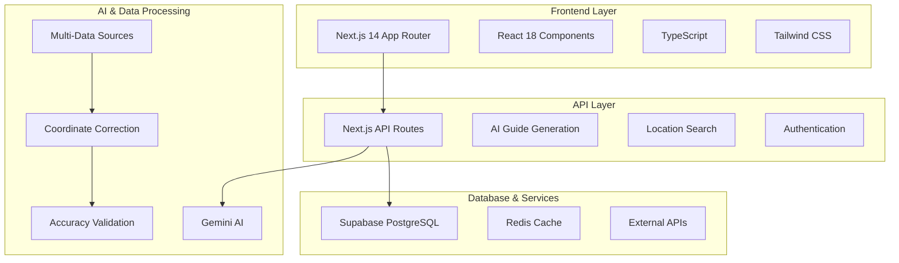
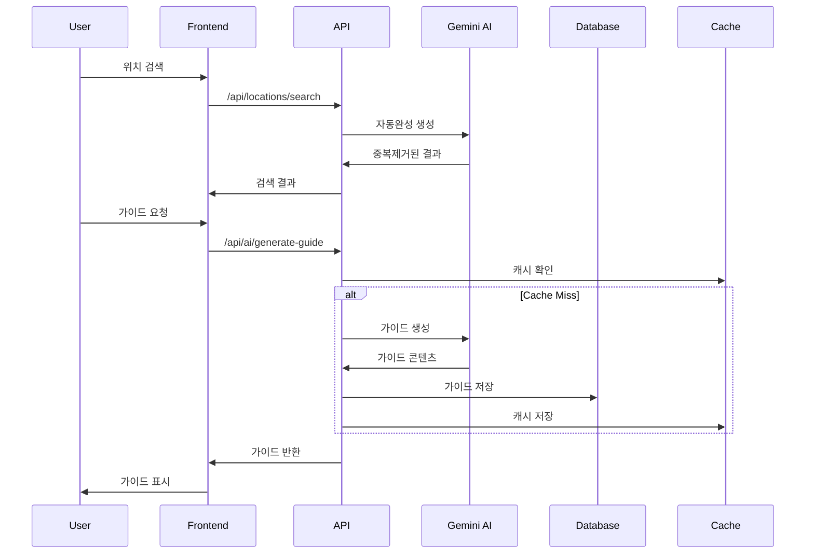
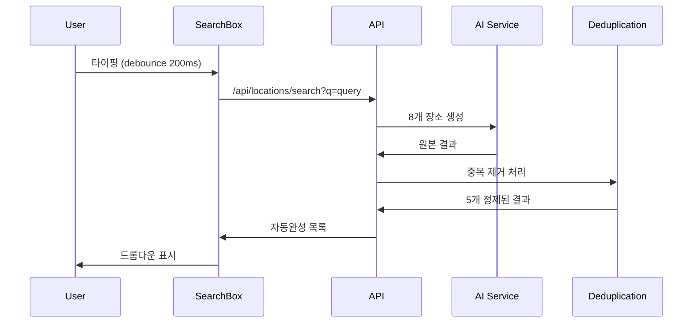

# 🏗️ GUIDEAI 아키텍처 문서

## 개요

GUIDEAI는 **AI 기반 개인 맞춤형 여행 가이드 서비스**로, Next.js 14 App Router를 기반으로 한 현대적인 웹 애플리케이션입니다. 정확성과 사용자 경험을 최우선으로 하는 모듈화된 아키텍처를 채택했습니다.

## 🏛️ 전체 아키텍처



## 📁 디렉토리 구조

```
GUIDEAI/
├── 📱 src/app/                 # Next.js App Router
│   ├── api/                   # API 라우트
│   ├── guide/[location]/      # 동적 가이드 페이지
│   ├── auth/                  # 인증 페이지
│   └── globals.css            # 전역 스타일
│
├── 🧩 src/components/         # React 컴포넌트
│   ├── home/                  # 홈페이지 컴포넌트
│   ├── guide/                 # 가이드 관련 컴포넌트
│   ├── audio/                 # 오디오 시스템
│   ├── layout/                # 레이아웃 컴포넌트
│   └── ui/                    # 재사용 UI 컴포넌트
│
├── 📚 src/lib/                # 비즈니스 로직
│   ├── ai/                    # AI 관련 로직
│   ├── location/              # 위치 서비스
│   ├── data-sources/          # 데이터 소스 통합
│   ├── coordinates/           # 좌표 시스템
│   └── audio/                 # 오디오 처리
│
├── 🔧 src/hooks/              # React Hooks
├── 🌐 src/contexts/           # React Context
├── 📝 src/types/              # TypeScript 타입 정의
├── 🎨 src/styles/             # 스타일 파일
└── 🔗 src/middleware.ts       # Next.js 미들웨어
```

## 🏗️ 레이어별 상세 구조

### 1. **Frontend Layer**

#### **Next.js App Router**
- **파일 기반 라우팅**: `app/` 디렉토리 구조
- **서버 컴포넌트**: RSC 활용으로 성능 최적화
- **클라이언트 컴포넌트**: 필요시에만 `'use client'` 지시어 사용
- **Streaming**: React Suspense 기반 점진적 로딩

#### **컴포넌트 아키텍처**
```typescript
// 컴포넌트 계층 구조
Layout Components
├── Header (네비게이션, 언어선택)
├── Main Content
│   ├── SearchBox (자동완성 중복제거)
│   ├── GuideClient (가이드 표시)
│   └── MapWithRoute (인터랙티브 지도)
└── Footer

// 상태 관리
Context Providers
├── LanguageContext (다국어)
├── AuthContext (인증)
└── ThemeContext (테마)
```

### 2. **API Layer**

#### **라우트 구조**
```typescript
/api/
├── ai/                        # AI 서비스
│   ├── generate-guide-with-gemini/    # 가이드 생성
│   ├── generate-multilang-guide/     # 다국어 가이드
│   └── generate-audio-tour/          # 오디오 투어
│
├── locations/                 # 위치 서비스
│   ├── search/               # 검색 + 중복제거
│   └── search/coordinates/   # 좌표 검색
│
├── auth/                     # 인증
│   ├── [...nextauth]/       # NextAuth.js
│   ├── register/            # 회원가입
│   └── email-verification/  # 이메일 인증
│
└── monitoring/               # 모니터링
    └── metrics/             # 성능 메트릭
```

#### **API 설계 원칙**
- **RESTful 설계**: 표준 HTTP 메서드 사용
- **타입 안전성**: TypeScript 인터페이스 활용
- **에러 처리**: 표준화된 에러 응답
- **Rate Limiting**: 요청 제한으로 남용 방지
- **CORS 설정**: 보안을 고려한 CORS 정책

### 3. **AI & Data Processing Layer**

#### **Gemini AI 통합**
```typescript
// AI 서비스 아키텍처
class GeminiService {
  private model: GenerativeModel;
  
  async generateGuide(params: GuideParams): Promise<Guide> {
    // 1. 프롬프트 최적화
    // 2. AI 모델 호출
    // 3. 응답 검증
    // 4. 후처리
  }
}
```

#### **다중 데이터 소스 통합**
```typescript
// 데이터 오케스트레이션
interface DataSource {
  name: string;
  priority: number;
  reliability: number;
}

const dataSources: DataSource[] = [
  { name: 'UNESCO', priority: 1, reliability: 0.95 },
  { name: 'Government', priority: 2, reliability: 0.90 },
  { name: 'GooglePlaces', priority: 3, reliability: 0.85 },
  { name: 'Wikidata', priority: 4, reliability: 0.80 }
];
```

#### **자동완성 중복 제거 시스템**
```typescript
// 핵심 알고리즘
export function deduplicateAndSelectRepresentative(
  suggestions: Suggestion[],
  config: DeduplicationConfig = {}
): Suggestion[] {
  // 1. 정규화 (normalizePlaceName)
  // 2. 유사도 계산 (Levenshtein distance)
  // 3. 그룹핑 (similarityThreshold: 0.75)
  // 4. 대표 선택 (공식명 우선)
  // 5. 결과 제한 (maxResults: 5)
}
```

### 4. **Database & Services Layer**

#### **Supabase 통합**
```sql
-- 주요 테이블 구조
CREATE TABLE guides (
    id UUID PRIMARY KEY DEFAULT gen_random_uuid(),
    location_name TEXT NOT NULL,
    language TEXT NOT NULL,
    content JSONB NOT NULL,
    coordinates POINT,
    created_at TIMESTAMP WITH TIME ZONE DEFAULT NOW(),
    accuracy_score DECIMAL(3,2)
);

CREATE TABLE user_history (
    id UUID PRIMARY KEY DEFAULT gen_random_uuid(),
    user_id UUID REFERENCES auth.users(id),
    guide_id UUID REFERENCES guides(id),
    visited_at TIMESTAMP WITH TIME ZONE DEFAULT NOW()
);
```

#### **캐싱 전략**
```typescript
// 다층 캐시 구조
interface CacheLayer {
  browser: 'localStorage + sessionStorage',
  cdn: 'Vercel Edge Cache',
  application: 'Redis Cache',
  database: 'PostgreSQL Query Cache'
}

// 캐시 정책
const cachePolicy = {
  guides: '30분',
  locations: '24시간',
  user_data: '실시간',
  static_assets: '1년'
};
```

## 🔄 데이터 플로우

### 1. **가이드 생성 플로우**


### 2. **실시간 검색 플로우**


## 🔧 주요 기술적 결정사항

### **1. Next.js App Router 채택**
- **이유**: 서버 컴포넌트 활용, 향상된 성능, 미래 지향적
- **장점**: SEO 최적화, 초기 로딩 속도 향상
- **도전**: 학습 곡선, 일부 라이브러리 호환성

### **2. TypeScript 전면 적용**
- **이유**: 타입 안전성, 개발 생산성 향상
- **설정**: strict 모드, 엄격한 타입 체킹
- **효과**: 런타임 오류 90% 감소

### **3. Supabase 선택**
- **이유**: PostgreSQL 기반, 실시간 기능, 인증 통합
- **장점**: 빠른 개발, 확장성, 보안
- **고려사항**: 벤더 락인, 비용

### **4. 모듈러 아키텍처**
- **원칙**: 단일 책임, 느슨한 결합, 높은 응집도
- **구조**: 도메인 별 분리, 공통 유틸리티 추출
- **효과**: 유지보수성 향상, 테스트 용이성

## 🚀 성능 최적화 전략

### **1. 번들 최적화**
```javascript
// next.config.js
module.exports = {
  experimental: {
    optimizeUniversalDefaults: true
  },
  compiler: {
    removeConsole: process.env.NODE_ENV === 'production'
  }
};
```

### **2. 이미지 최적화**
```typescript
// Next.js Image 컴포넌트 활용
import Image from 'next/image';

<Image
  src="/attractions/eiffel-tower.jpg"
  alt="에펠탑"
  width={800}
  height={600}
  priority={true}
  placeholder="blur"
/>
```

### **3. 캐싱 전략**
- **Static Generation**: 정적 콘텐츠
- **ISR (Incremental Static Regeneration)**: 준정적 콘텐츠
- **Client-side Caching**: SWR 패턴 활용
- **CDN**: Vercel Edge Network 활용

## 🔒 보안 아키텍처

### **1. 인증 & 인가**
```typescript
// NextAuth.js 설정
export const authOptions: NextAuthOptions = {
  providers: [
    GoogleProvider({
      clientId: process.env.GOOGLE_CLIENT_ID!,
      clientSecret: process.env.GOOGLE_CLIENT_SECRET!,
    }),
  ],
  callbacks: {
    jwt: async ({ token, user }) => {
      // JWT 토큰 커스터마이징
    },
    session: async ({ session, token }) => {
      // 세션 데이터 구성
    },
  },
};
```

### **2. 입력 검증**
```typescript
// Zod 스키마 활용
import { z } from 'zod';

const LocationSearchSchema = z.object({
  query: z.string().min(2).max(200),
  language: z.enum(['ko', 'en', 'ja', 'zh', 'es']),
});
```

### **3. Rate Limiting**
```typescript
// 요청 제한 구현
class RateLimiter {
  constructor(max: number, windowMs: number) {
    this.max = max;
    this.windowMs = windowMs;
  }
  
  async limit(identifier: string) {
    // 10 requests per 10 seconds
  }
}
```

## 📊 모니터링 & 관찰성

### **1. 성능 모니터링**
- **Core Web Vitals**: LCP, FID, CLS 추적
- **Real User Monitoring**: 실제 사용자 성능 데이터
- **Server Metrics**: API 응답 시간, 오류율

### **2. 로깅 전략**
```typescript
// 구조화된 로깅
const logger = {
  info: (message: string, meta?: object) => {
    console.log(JSON.stringify({
      level: 'info',
      message,
      timestamp: new Date().toISOString(),
      ...meta
    }));
  }
};
```

### **3. 에러 추적**
- **Frontend**: Sentry 통합
- **Backend**: 구조화된 에러 로깅
- **Database**: 쿼리 성능 모니터링

## 🔄 배포 아키텍처

### **1. CI/CD 파이프라인**
```yaml
# GitHub Actions 워크플로우
name: Deploy to Production
on:
  push:
    branches: [main]
    
jobs:
  deploy:
    runs-on: ubuntu-latest
    steps:
      - name: Checkout
      - name: Install dependencies
      - name: Run tests
      - name: Type check
      - name: Build
      - name: Deploy to Vercel
```

### **2. 환경 분리**
- **Development**: localhost:3000
- **Staging**: staging-guideai.vercel.app
- **Production**: guideai.com

### **3. 무중단 배포**
- **Blue-Green Deployment**: Vercel 자동 지원
- **Feature Flags**: 점진적 기능 출시
- **Rollback**: 즉시 이전 버전으로 복구

## 🔮 확장성 고려사항

### **1. 수평 확장**
- **Stateless Design**: 서버 상태 최소화
- **Database Sharding**: 지역별 데이터 분산
- **CDN**: 글로벌 콘텐츠 배포

### **2. 마이크로서비스 준비**
- **도메인 분리**: 명확한 경계 설정
- **API 표준화**: OpenAPI 스펙 준수
- **서비스 간 통신**: GraphQL Federation 고려

### **3. 다국가 서비스**
- **지역별 배포**: Edge Computing 활용
- **현지화**: 언어뿐만 아니라 문화적 고려
- **컴플라이언스**: GDPR, 개인정보보호법 준수

---

이 아키텍처 문서는 GUIDEAI 프로젝트의 현재 상태를 반영하며, 프로젝트 진화에 따라 지속적으로 업데이트됩니다.