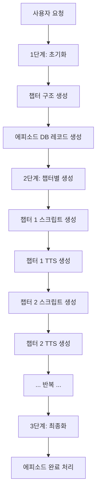

# 챕터별 순차 팟캐스트 생성 시스템 사용 가이드

## 🎯 개요

새로운 챕터별 순차 생성 시스템은 기존의 한 번에 모든 챕터를 생성하던 방식을 개선하여, 각 챕터를 단계별로 생성함으로써 안정성을 크게 향상시킨 시스템입니다.

## 📋 주요 개선사항

### ✅ 안정성 개선
- **한 번에 모든 챕터 생성 → 챕터별 순차 생성**으로 변경
- API 타임아웃 및 메모리 오류 방지
- 실패한 챕터만 재시도 가능

### ✅ 사용자 경험 개선
- 실시간 챕터별 진행 상황 표시
- 각 챕터의 생성 상태 추적 (대기 중, 생성 중, 완료, 오류)
- 부분적으로 완성된 팟캐스트도 재생 가능

### ✅ 기술적 개선
- **진행자(male)/게스트(female)** 음성 역할 분리
- 언어별 최적화된 음성 프로필 사용
- DB 구조 최적화 (podcast_episodes, podcast_segments)

## 🚀 사용 방법

### 1. 새 컴포넌트 사용

기존 `NotebookLMPodcastPlayer` 대신 새로운 `ChapterBasedPodcastGenerator`를 사용하세요:

```tsx
import ChapterBasedPodcastGenerator from '@/components/audio/ChapterBasedPodcastGenerator';

// 사용 예시
<ChapterBasedPodcastGenerator
  locationName="경복궁"
  language="ko"
  onGenerationComplete={(data) => {
    console.log('팟캐스트 생성 완료:', data);
  }}
/>
```

### 2. API 엔드포인트

새로운 API 엔드포인트: `/api/tts/notebooklm/generate-by-chapter`

#### 초기화 (1단계)
```javascript
POST /api/tts/notebooklm/generate-by-chapter
{
  "locationName": "경복궁",
  "language": "ko",
  "action": "init"
}
```

#### 챕터 생성 (2단계)
```javascript
POST /api/tts/notebooklm/generate-by-chapter
{
  "locationName": "경복궁",
  "language": "ko",
  "action": "generate_chapter",
  "chapterIndex": 0
}
```

#### 최종화 (3단계)
```javascript
POST /api/tts/notebooklm/generate-by-chapter
{
  "locationName": "경복궁",
  "language": "ko",
  "action": "finalize"
}
```

### 3. 진행 상황 확인
```javascript
GET /api/tts/notebooklm/generate-by-chapter?location=경복궁&language=ko
```

## 🔧 시스템 아키텍처

### 생성 과정


### DB 구조
```sql
-- 에피소드 정보
podcast_episodes {
  id: "episode-12345",
  location_slug: "gyeongbokgung",
  status: "generating" | "completed" | "failed"
}

-- 개별 세그먼트
podcast_segments {
  episode_id: "episode-12345",
  sequence_number: 1,
  speaker_type: "male" | "female",
  audio_url: "https://supabase.../1-1ko.mp3"
}
```

## 🧪 테스트 방법

### 1. 개발 서버 시작
```bash
npm run dev
```

### 2. 테스트 페이지 접근
브라우저에서 팟캐스트 컴포넌트가 있는 페이지로 이동

### 3. 단계별 테스트

#### 초기화 테스트
1. "챕터별 순차 팟캐스트 생성" 버튼 클릭
2. 챕터 구조가 생성되는지 확인
3. 각 챕터의 초기 상태가 "pending"인지 확인

#### 챕터 생성 테스트
1. 각 챕터가 순서대로 생성되는지 확인
2. 챕터 상태 변화 확인: `pending` → `generating` → `completed`
3. 진행률 표시가 정확한지 확인

#### 재생 테스트
1. 생성된 세그먼트가 정상 재생되는지 확인
2. 진행자/게스트 음성이 구분되는지 확인
3. 세그먼트 간 자동 전환이 작동하는지 확인

### 4. 오류 처리 테스트

#### 네트워크 오류 시뮬레이션
```bash
# 개발자 도구에서 네트워크 탭을 열고 Slow 3G 설정으로 테스트
```

#### 부분 실패 시나리오
- 일부 챕터만 생성된 상태에서 페이지 새로고침
- 기존 진행 상황이 올바르게 복원되는지 확인

## 🐛 문제 해결

### 일반적인 문제들

#### 1. "챕터별 순차 생성 시스템 구현" 완료 상태 확인
```javascript
// 브라우저 콘솔에서 실행
console.log('API 응답 확인:', await fetch('/api/tts/notebooklm/generate-by-chapter?location=test&language=ko'));
```

#### 2. DB 연결 문제
```bash
# 환경 변수 확인
echo $NEXT_PUBLIC_SUPABASE_URL
echo $NEXT_PUBLIC_SUPABASE_ANON_KEY
```

#### 3. TTS API 문제
```javascript
// TTS API 직접 테스트
fetch('/api/tts/multi-voice', {
  method: 'POST',
  headers: { 'Content-Type': 'application/json' },
  body: JSON.stringify({
    text: '테스트 텍스트',
    language: 'ko-KR',
    voice: 'ko-KR-Neural2-A'
  })
});
```

### 로그 확인
```bash
# 서버 로그에서 다음 패턴 확인
grep "챕터.*생성" .next/server.log
grep "TTS 생성" .next/server.log
grep "에러" .next/server.log
```

## 📊 성능 모니터링

### 주요 메트릭
- **챕터당 평균 생성 시간**: ~2-3분
- **TTS 세그먼트당 생성 시간**: ~10-15초  
- **전체 팟캐스트 생성 시간**: ~10-15분 (5챕터 기준)

### 모니터링 코드
```javascript
// 성능 측정
const startTime = Date.now();
// ... 생성 과정 ...
const endTime = Date.now();
console.log(`생성 완료: ${(endTime - startTime) / 1000}초`);
```

## 🔄 기존 시스템과의 호환성

### 마이그레이션
- 기존 `NotebookLMPodcastPlayer` → `ChapterBasedPodcastGenerator`
- 기존 API `/api/tts/notebooklm/generate` → `/api/tts/notebooklm/generate-by-chapter`
- 기존 DB 레코드는 자동으로 호환됨

### 점진적 적용
1. 새 컴포넌트를 별도 페이지에서 테스트
2. 기존 시스템과 병행 운영
3. 안정성 확인 후 전면 교체

## ✅ 체크리스트

### 구현 완료 확인
- [x] 챕터별 API 엔드포인트 구현
- [x] 순차 생성 로직 구현  
- [x] React 컴포넌트 구현
- [x] 진행자/게스트 음성 분리
- [x] 실시간 진행 상황 표시
- [x] 오류 처리 및 복구 로직
- [x] DB 스키마 최적화

### 테스트 완료 확인
- [ ] 초기화 프로세스 테스트
- [ ] 챕터별 생성 테스트
- [ ] 재생 기능 테스트
- [ ] 오류 복구 테스트
- [ ] 성능 테스트
- [ ] 다국어 지원 테스트

## 🎉 결론

새로운 챕터별 순차 생성 시스템은 기존 시스템의 안정성 문제를 해결하고, 사용자 경험을 대폭 개선한 솔루션입니다. 

**주요 장점:**
- ✅ 한 번에 모든 챕터 생성으로 인한 타임아웃 오류 해결
- ✅ 실시간 진행 상황 표시로 사용자 불안감 해소  
- ✅ 부분 실패 시 재시도 가능으로 안정성 향상
- ✅ 진행자/게스트 음성 분리로 자연스러운 대화 구현

이제 사용자는 안정적이고 예측 가능한 팟캐스트 생성 경험을 할 수 있습니다!