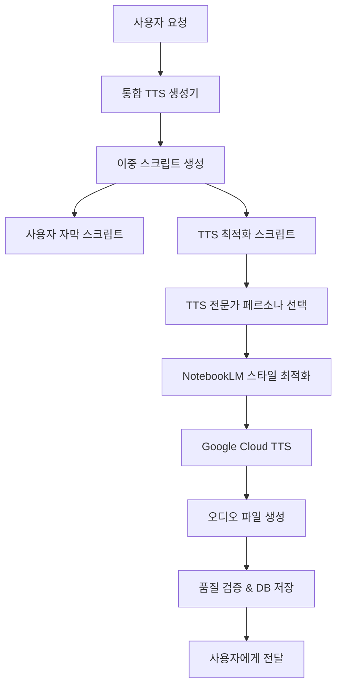

# 📋 NotebookLM 스타일 TTS 생성 시스템 구현 로드맵

## 🎯 프로젝트 개요

TripRadio.AI에 Google NotebookLM 스타일의 대화형 박물관 오디오 가이드 시스템을 구현합니다. 이중 스크립트 생성, TTS 전문가 페르소나, 대화형 TTS 생성기를 통한 최고 품질의 팟캐스트형 가이드를 제공합니다.

## 🏗️ 시스템 아키텍처



## 📊 현재 완료 상태

### ✅ 완료된 컴포넌트 (100%)
1. **이중 스크립트 생성기** (`src/lib/ai/scripts/dual-script-generator.ts`)
2. **TTS 전문가 페르소나 시스템** (`src/lib/ai/personas/tts-expert-persona.ts`)
3. **대화형 TTS 생성기** (`src/lib/ai/tts/conversational-tts-generator.ts`)
4. **NotebookLM 스타일 최적화 가이드** (`src/lib/ai/optimization/notebooklm-tts-optimization-guide.ts`)
5. **통합 팟캐스트 생성 시스템** (`enhanced-podcast-with-dual-scripts.js`)

### 🔄 진행 중인 작업
- DB 스키마 확장 설계
- Google Cloud TTS 통합 구현
- 품질 검증 시스템 개선

## 📅 구현 로드맵

### Phase 1: 기반 인프라 구축 (1-2주)

#### 1.1 데이터베이스 스키마 확장
```sql
-- 이중 스크립트 저장을 위한 스키마 확장
ALTER TABLE guide_chapters ADD COLUMN 
    user_script TEXT,           -- 사용자용 자막
    tts_script TEXT,            -- TTS용 SSML 스크립트
    tts_system_prompt TEXT,     -- TTS 생성 시스템 프롬프트
    audio_metadata JSONB,       -- 오디오 메타데이터
    script_version VARCHAR(10) DEFAULT 'v1.0';

-- 오디오 파일 정보 확장
ALTER TABLE audio_files ADD COLUMN
    tts_engine VARCHAR(50) DEFAULT 'google-cloud-tts',
    voice_profile JSONB,        -- 음성 프로필
    audio_quality VARCHAR(20) DEFAULT 'standard',
    generation_metadata JSONB;  -- 생성 메타데이터
```

**담당**: 백엔드 개발자  
**예상 소요시간**: 3-5일  
**우선순위**: 높음

#### 1.2 Google Cloud TTS 클라이언트 설정
- Google Cloud TTS API 키 설정
- 한국어 Neural2 음성 모델 테스트
- SSML 태그 지원 확인
- 오디오 파일 저장 시스템 구현

**파일**: `src/lib/tts/google-cloud-tts-client.ts`  
**담당**: 백엔드/TTS 전문가  
**예상 소요시간**: 3-4일  
**우선순위**: 높음

#### 1.3 환경 변수 및 설정
```env
# Google Cloud TTS
GOOGLE_CLOUD_TTS_API_KEY=your_api_key
GOOGLE_CLOUD_TTS_PROJECT_ID=your_project_id

# TTS 설정
TTS_DEFAULT_VOICE_PRIMARY=ko-KR-Neural2-A
TTS_DEFAULT_VOICE_SECONDARY=ko-KR-Neural2-C
TTS_OUTPUT_FORMAT=mp3
TTS_AUDIO_QUALITY=high
```

### Phase 2: 핵심 TTS 시스템 구현 (2-3주)

#### 2.1 통합 TTS API 개발
**파일**: `src/app/api/tts/generate/route.ts`

```typescript
// POST /api/tts/generate
{
  locationId: string,
  chapterIndex: number,
  language: string,
  options?: {
    priority: 'engagement' | 'accuracy' | 'emotion',
    audienceLevel: 'beginner' | 'intermediate' | 'advanced',
    customPersona?: string
  }
}

// Response
{
  userScript: UserChapterScript,
  ttsScript: TTSAudioScript,
  audioFiles: GeneratedAudioFile[],
  metadata: TTSGenerationMetadata,
  qualityScore: number
}
```

**주요 기능**:
- 기존 가이드 콘텐츠 로드
- 이중 스크립트 생성 호출
- TTS 전문가 페르소나 자동 선택
- NotebookLM 스타일 최적화 적용
- 오디오 생성 및 저장
- 품질 검증 및 DB 업데이트

**담당**: 풀스택 개발자  
**예상 소요시간**: 7-10일  
**우선순위**: 높음

#### 2.2 프론트엔드 TTS 컨트롤 UI 개발
**파일**: `src/components/audio/TTSGenerationPanel.tsx`

**기능**:
- TTS 생성 요청 버튼
- 생성 진행 상태 표시
- 오디오 미리듣기
- 품질 점수 표시
- 재생성 옵션

**담당**: 프론트엔드 개발자  
**예상 소요시간**: 5-7일  
**우선순위**: 중간

#### 2.3 오디오 플레이어 통합
**파일**: `src/components/audio/ConversationalAudioPlayer.tsx`

**기능**:
- 대화형 오디오 재생
- 자막 동기화 표시
- 화자별 하이라이트
- 재생 속도 조절
- 챕터별 네비게이션

**담당**: 프론트엔드 개발자  
**예상 소요시간**: 5-6일  
**우선순위**: 중간

### Phase 3: 품질 최적화 및 사용자 경험 개선 (2주)

#### 3.1 품질 검증 시스템 강화
**파일**: `src/lib/quality/tts-quality-validator.ts`

**기능**:
- 자동 품질 평가 (목표: 85+ 점수)
- SSML 태그 검증
- 오디오 길이 검증
- 페르소나 특성 반영도 검사
- 자동 재생성 트리거

**담당**: QA/백엔드 개발자  
**예상 소요시간**: 4-5일  
**우선순위**: 높음

#### 3.2 캐싱 및 성능 최적화
- 생성된 오디오 파일 캐싱
- 동일한 콘텐츠 중복 생성 방지
- 병렬 처리 최적화
- CDN 통합 (오디오 파일 전송)

**담당**: DevOps/백엔드 개발자  
**예상 소요시간**: 3-4일  
**우선순위**: 중간

#### 3.3 A/B 테스트 시스템
- NotebookLM 스타일 vs 기존 TTS 비교
- 사용자 만족도 측정
- 품질 메트릭 수집
- 개선점 도출

**담당**: 데이터 분석가/개발자  
**예상 소요시간**: 5-7일  
**우선순위**: 중간

### Phase 4: 고급 기능 및 확장 (2-3주)

#### 4.1 다국어 지원 확장
- 영어, 일본어, 중국어 TTS 페르소나
- 언어별 대화 패턴 최적화
- 문화적 맥락 반영
- 발음 가이드 다국어화

**파일**: 
- `src/lib/ai/personas/multilingual-tts-personas.ts`
- `src/lib/ai/optimization/multilingual-optimization.ts`

**담당**: 국제화 전문가/개발자  
**예상 소요시간**: 10-12일  
**우선순위**: 낮음

#### 4.2 사용자 맞춤화 기능
- 개인 선호도 학습
- 맞춤형 페르소나 추천
- 재생 속도/톤 개인화
- 관심 분야별 강조점 조절

**파일**: `src/lib/personalization/tts-personalization.ts`

**담당**: ML 엔지니어/개발자  
**예상 소요시간**: 8-10일  
**우선순위**: 낮음

#### 4.3 실시간 대화 기능 (미래 계획)
- NotebookLM의 Interactive Mode 구현
- 사용자 질문에 실시간 답변
- 동적 대화 흐름 조정
- 음성 인식 통합

**파일**: `src/lib/ai/interactive/real-time-conversation.ts`

**담당**: AI/음성 전문가  
**예상 소요시간**: 15-20일  
**우선순위**: 매우 낮음 (Phase 5 이후)

### Phase 5: 테스트 및 배포 (1-2주)

#### 5.1 통합 테스트
- 전체 워크플로우 테스트
- 성능 테스트 (동시 사용자 100명)
- 오디오 품질 검증
- 에러 처리 테스트

#### 5.2 베타 테스트
- 내부 팀 테스트
- 파워 유저 베타 테스트
- 피드백 수집 및 개선
- 최종 품질 검증

#### 5.3 프로덕션 배포
- 단계별 배포 (Feature Flag)
- 모니터링 시스템 구축
- 사용자 가이드 작성
- 런칭 준비

## 🛠️ 기술 스택

### Backend
- **TTS Engine**: Google Cloud Text-to-Speech
- **Database**: Supabase PostgreSQL (스키마 확장)
- **Audio Storage**: Supabase Storage 또는 Google Cloud Storage
- **API**: Next.js API Routes

### Frontend
- **Audio Player**: HTML5 Audio API + Custom Controls
- **UI Components**: 기존 TripRadio.AI 디자인 시스템
- **State Management**: React Hooks + Context

### AI/ML
- **LLM**: Google Gemini 2.5 Pro (스크립트 생성)
- **TTS**: Google Cloud TTS Neural2 Voices
- **최적화**: 자체 개발한 NotebookLM 스타일 최적화

### DevOps
- **Monitoring**: Google Cloud Monitoring
- **CDN**: Vercel 또는 CloudFlare (오디오 파일)
- **Caching**: Redis (오디오 메타데이터)

## 📊 성공 지표 (KPI)

### 품질 지표
- **TTS 품질 점수**: 85+ (목표)
- **사용자 만족도**: 4.5/5.0 (목표)
- **오디오 재생 완료율**: 80% (목표)
- **재생성 요청 비율**: <10% (목표)

### 성능 지표
- **오디오 생성 시간**: <30초 (챕터당)
- **API 응답 시간**: <5초 (스크립트 생성)
- **오디오 로딩 시간**: <3초 (재생 시작)
- **동시 생성 처리**: 10개 요청

### 비즈니스 지표
- **TTS 기능 사용률**: 월 활성 사용자의 60%
- **프리미엄 전환율**: TTS 사용자 중 25%
- **체류 시간 증가**: 팟캐스트 사용시 30% 증가
- **구매 전환율**: 오디오 가이드 → 프리미엄 15%

## 🚨 리스크 관리

### 기술적 리스크
1. **Google Cloud TTS 비용**: 사용량 모니터링, 최적화 필요
2. **오디오 품질**: 지속적인 품질 검증 시스템 필요
3. **생성 속도**: 병렬 처리 및 캐싱으로 최적화
4. **저장 공간**: 효율적인 압축 및 CDN 활용

### 비즈니스 리스크  
1. **사용자 수용도**: A/B 테스트로 검증
2. **경쟁사 대응**: 차별화된 NotebookLM 스타일 유지
3. **비용 증가**: ROI 모니터링 및 가격 정책 조정
4. **법적 이슈**: TTS 사용 권한 및 저작권 확인

### 완화 전략
- 단계별 출시 (Feature Flag)
- 실시간 모니터링 시스템
- 자동 롤백 메커니즘
- 사용자 피드백 빠른 반영

## 🎯 다음 단계

### 즉시 시작할 작업 (이번 주)
1. **DB 스키마 확장 구현** - 이중 스크립트 저장
2. **Google Cloud TTS 클라이언트 설정** - API 키 및 테스트
3. **기존 코드 통합** - 완성된 컴포넌트들 프로젝트 통합

### 우선순위 작업 (2주 내)
1. **통합 TTS API 개발** - 전체 워크플로우 구현
2. **프론트엔드 UI 개발** - TTS 생성 및 재생 인터페이스
3. **품질 검증 시스템** - 자동 품질 평가 및 개선

### 장기 계획 (1-3개월)
1. **다국어 지원 확장** - 글로벌 서비스 준비
2. **개인화 기능** - 사용자 맞춤형 TTS
3. **실시간 대화 기능** - NotebookLM Interactive Mode

---

## 📚 참고 자료

### 기술 문서
- [Google Cloud Text-to-Speech API](https://cloud.google.com/text-to-speech/docs)
- [SSML 표준 문서](https://www.w3.org/TR/speech-synthesis11/)
- [NotebookLM 공식 문서](https://support.google.com/notebooklm)

### 완성된 컴포넌트
1. `src/lib/ai/scripts/dual-script-generator.ts` - 이중 스크립트 생성
2. `src/lib/ai/personas/tts-expert-persona.ts` - TTS 전문가 페르소나
3. `src/lib/ai/tts/conversational-tts-generator.ts` - 대화형 TTS 생성기
4. `src/lib/ai/optimization/notebooklm-tts-optimization-guide.ts` - 최적화 가이드
5. `enhanced-podcast-with-dual-scripts.js` - 통합 시스템 테스트 코드

### 설계 원칙
- **NotebookLM 스타일**: 자연스러운 대화, 감정적 깊이, 정보 레이어링
- **사용자 중심**: 청취자 경험 최우선, 직관적 인터페이스
- **품질 제일**: 85+ 품질 점수 목표, 지속적 개선
- **확장성**: 다국어, 개인화, 실시간 대화 준비

---

**프로젝트 총 예상 기간**: 8-12주  
**필요 인력**: 풀스택 개발자 2명, 프론트엔드 1명, QA 1명, DevOps 1명  
**예산 고려사항**: Google Cloud TTS API 비용, 오디오 저장소 비용, CDN 비용

이 로드맵을 기반으로 NotebookLM 스타일의 혁신적인 박물관 오디오 가이드 시스템을 성공적으로 구현할 수 있을 것입니다! 🎉