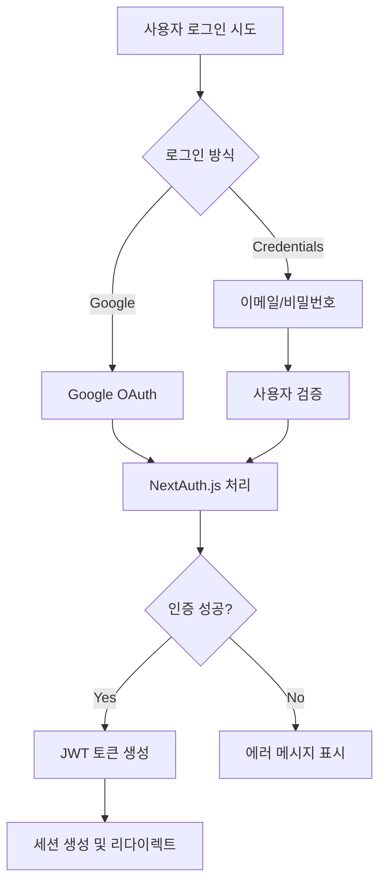

# GUIDEAI 서비스 아키텍처 및 워크플로우 종합분석

## 📋 개요

GUIDEAI는 AI 기반 개인화된 여행 가이드 서비스로, Next.js 14, TypeScript, Supabase, Google Gemini AI를 활용하여 구축된 풀스택 웹 애플리케이션입니다.

## 🏗️ 아키텍처 개요

### 기술 스택
- **Frontend**: Next.js 14, React 18, TypeScript, Tailwind CSS, Radix UI
- **Backend**: Next.js API Routes, Node.js Runtime
- **Database**: Supabase (PostgreSQL)
- **AI Services**: Google Gemini AI
- **Authentication**: NextAuth.js (Google, Credentials)
- **State Management**: Zustand, React Context API
- **Caching**: Service Worker (PWA), localStorage, sessionStorage
- **Deployment**: PWA 지원, Service Worker 기반 캐싱

### 프로젝트 구조
```
C:\GUIDEAI/
├── src/
│   ├── app/                    # Next.js App Router
│   │   ├── api/               # API Routes
│   │   ├── auth/              # 인증 페이지
│   │   ├── guide/             # 가이드 페이지
│   │   ├── legal/             # 법적 문서
│   │   └── page.tsx           # 메인 홈페이지
│   ├── components/            # React 컴포넌트
│   ├── contexts/              # React Context
│   ├── hooks/                 # Custom Hooks
│   ├── lib/                   # 유틸리티 및 서비스
│   ├── types/                 # TypeScript 타입
│   └── styles/                # 스타일 파일
├── public/                    # 정적 파일
├── middleware.ts              # Next.js 미들웨어
└── 설정 파일들
```

## 🔄 핵심 워크플로우 분석

### 1. 홈페이지 → 가이드 생성 워크플로우

#### 1.1 검색 및 자동완성 플로우
```mermaid
graph TD
    A[사용자 검색어 입력] --> B[자동완성 API 호출]
    B --> C[/api/locations/search]
    C --> D[Gemini AI 추천 생성]
    D --> E[캐시된 결과 반환]
    E --> F[자동완성 드롭다운 표시]
    F --> G[사용자 선택]
    G --> H[router.push to /guide/[location]]
```

**관련 파일:**
- `src/app/page.tsx:430-437` - 자동완성 선택 이벤트 핸들러
- `src/components/home/NextLevelSearchBox.tsx` - 고급 검색 컴포넌트
- `src/app/api/locations/search/route.ts` - 검색 API
- `src/contexts/LanguageContext.tsx` - 다국어 지원

#### 1.2 가이드 생성 플로우
```mermaid
graph TD
    A[/guide/[location] 페이지 접근] --> B[서버사이드 가이드 조회]
    B --> C{Supabase에 캐시된 가이드 존재?}
    C -->|Yes| D[캐시된 가이드 사용]
    C -->|No| E[AI 가이드 생성 요청]
    E --> F[/api/ai/generate-guide-with-gemini]
    F --> G[Gemini AI 가이드 생성]
    G --> H[데이터 검증 및 좌표 매핑]
    H --> I[Supabase 저장]
    I --> J[가이드 페이지 렌더링]
    D --> J
```

**관련 파일:**
- `src/app/guide/[location]/page.tsx:16-51` - 서버사이드 가이드 조회
- `src/app/guide/[location]/MultiLangGuideClient.tsx` - 클라이언트 가이드 컴포넌트
- `src/app/api/ai/generate-guide-with-gemini/route.ts:11-50` - AI 가이드 생성 API
- `src/lib/ai/gemini.ts:1-50` - Gemini AI 통합
- `src/types/guide.ts` - 가이드 데이터 타입 정의

### 2. 인증 워크플로우

#### 2.1 로그인 플로우


**관련 파일:**
- `src/lib/auth.ts:6-127` - NextAuth 설정
- `src/app/api/auth/[...nextauth]/route.ts` - NextAuth API 라우트
- `src/app/auth/signin/page.tsx` - 로그인 페이지
- `src/components/providers/SessionProvider.tsx` - 세션 Provider

### 3. 다국어 지원 워크플로우

#### 3.1 언어 전환 플로우
```mermaid
graph TD
    A[언어 선택] --> B[LanguageContext.setLanguage]
    B --> C[번역 파일 로드]
    C --> D[/public/locales/translations.json]
    D --> E[세션 스토리지 캐시]
    E --> F[UI 재렌더링]
    F --> G[localStorage 저장]
```

**관련 파일:**
- `src/contexts/LanguageContext.tsx:565-674` - 언어 컨텍스트
- `public/locales/translations.json` - 번역 데이터
- `src/components/LanguageSelector.tsx` - 언어 선택 컴포넌트

## 🗄️ 데이터베이스 스키마

### Supabase 테이블 구조
```sql
-- 가이드 데이터 테이블
guides (
  id: bigint PRIMARY KEY,
  locationname: text,
  language: text,
  content: jsonb,           -- GuideData 타입
  user_profile: jsonb,      -- UserProfile 타입
  created_at: timestamp,
  updated_at: timestamp
)

-- 사용자 인증 (NextAuth 테이블들)
accounts, sessions, users, verification_tokens
```

## 🔌 API 라우트 분석

### AI 관련 API
| 엔드포인트 | 메서드 | 기능 | 주요 파일 |
|------------|--------|------|-----------|
| `/api/ai/generate-guide-with-gemini` | POST | 메인 가이드 생성 | `src/app/api/ai/generate-guide-with-gemini/route.ts` |
| `/api/ai/generate-multilang-guide` | POST | 다국어 가이드 생성 | `src/app/api/ai/generate-multilang-guide/route.ts` |
| `/api/ai/generate-tts` | POST | 오디오 가이드 생성 | `src/app/api/ai/generate-tts/route.ts` |
| `/api/locations/search` | GET | 장소 검색 자동완성 | `src/app/api/locations/search/route.ts` |

### 인증 관련 API
| 엔드포인트 | 메서드 | 기능 | 주요 파일 |
|------------|--------|------|-----------|
| `/api/auth/[...nextauth]` | GET/POST | NextAuth 핸들러 | `src/app/api/auth/[...nextauth]/route.ts` |
| `/api/auth/register` | POST | 회원가입 | `src/app/api/auth/register/route.ts` |

### 기타 API
| 엔드포인트 | 메서드 | 기능 | 주요 파일 |
|------------|--------|------|-----------|
| `/api/health` | GET | 헬스체크 | `src/app/api/health/route.ts` |
| `/api/monitoring/metrics` | GET | 모니터링 메트릭 | `src/app/api/monitoring/metrics/route.ts` |
| `/api/quality-feedback` | POST | 품질 피드백 | `src/app/api/quality-feedback/route.ts` |

## 🧩 컴포넌트 계층구조

### 페이지 컴포넌트
```
App Layout (src/app/layout.tsx)
├── ClientLayout (src/components/layout/ClientLayout.tsx)
│   ├── Header (src/components/layout/Header.tsx)
│   ├── SessionProvider (src/components/providers/SessionProvider.tsx)
│   └── LanguageProvider (src/contexts/LanguageContext.tsx)
└── Page Content
    ├── HomePage (src/app/page.tsx)
    │   └── NextLevelSearchBox (src/components/home/NextLevelSearchBox.tsx)
    ├── GuidePage (src/app/guide/[location]/page.tsx)
    │   └── MultiLangGuideClient (src/app/guide/[location]/MultiLangGuideClient.tsx)
    │       └── TourContent (src/app/guide/[location]/tour/components/TourContent.tsx)
    └── AuthPages (src/app/auth/signin/page.tsx)
```

### UI 컴포넌트
- `src/components/ui/` - 기본 UI 컴포넌트 (button, card, badge 등)
- `src/components/audio/` - 오디오 플레이어 컴포넌트
- `src/components/guide/` - 가이드 관련 컴포넌트
- `src/components/layout/` - 레이아웃 컴포넌트

## 📊 상태관리 분석

### React Context
1. **LanguageContext** (`src/contexts/LanguageContext.tsx`)
   - 현재 언어 설정
   - 번역 데이터 관리
   - 언어 전환 로직

### Custom Hooks
1. **useAudioPlayer** (`src/hooks/useAudioPlayer.ts`) - 오디오 재생 관리
2. **useGeolocation** (`src/hooks/useGeolocation.ts`) - GPS 위치 추적
3. **useContextualRecommendations** (`src/hooks/useContextualRecommendations.ts`) - 맥락적 추천

### 로컬 스토리지 활용
- **언어 설정**: `localStorage.getItem('preferred-language')`
- **가이드 히스토리**: `src/lib/cache/localStorage.ts`
- **세션 캐시**: `sessionStorage` (번역 데이터)

## 🔗 외부 서비스 통합

### Google Services
1. **Gemini AI** (`src/lib/ai/gemini.ts`)
   - 가이드 텍스트 생성
   - 검색 자동완성
   - 다국어 번역

2. **Google OAuth** (`src/lib/auth.ts:8-11`)
   - 사용자 인증
   - 프로필 정보 관리

### Supabase Integration
1. **데이터베이스** (`src/lib/supabaseClient.ts`)
   - 가이드 데이터 저장/조회
   - 사용자 히스토리 관리

2. **실시간 기능** (구현된 경우)
   - 실시간 가이드 업데이트
   - 사용자 활동 추적

### 데이터 소스 통합
- **UNESCO Service** (`src/lib/data-sources/unesco/unesco-service.ts`)
- **Government Heritage API** (`src/lib/data-sources/government/heritage-wfs-service.ts`)
- **Wikidata Service** (`src/lib/data-sources/wikidata/wikidata-service.ts`)
- **Google Places API** (`src/lib/data-sources/google/places-service.ts`)

## ⚡ 성능 최적화 전략

### 캐싱 전략
1. **PWA 캐싱** (`next.config.js:2-126`)
   - Service Worker 기반 리소스 캐싱
   - API 응답 캐싱 (24시간)
   - 이미지 및 정적 자산 캐싱

2. **데이터베이스 캐싱**
   - Supabase에 생성된 가이드 저장
   - 중복 생성 방지

3. **메모리 캐싱**
   - LRU 캐시 구현 (`src/app/api/locations/search/route.ts:21-53`)
   - 검색 결과 30분 캐싱

### 코드 스플리팅
- Next.js 자동 코드 스플리팅
- 동적 임포트 활용
- 라우트별 청크 분리

### 이미지 최적화
- Next.js Image 컴포넌트 활용
- WebP 포맷 지원
- 반응형 이미지 제공

## 🔒 보안 및 검증

### API 보안
1. **Rate Limiting** (`src/lib/rate-limiter.ts`)
   - IP 기반 요청 제한
   - AI API 호출 제한 (5회/분)

2. **입력 검증**
   - XSS 방지를 위한 입력 새니타이징
   - SQL 인젝션 방지 (Supabase ORM)
   - 프롬프트 인젝션 방지

3. **Circuit Breaker** (`src/lib/circuit-breaker.ts`)
   - AI 서비스 장애 시 자동 차단
   - 점진적 복구 메커니즘

### 데이터 검증
1. **AI 응답 검증** (`src/lib/ai/validation/accuracy-validator.ts`)
   - 생성된 가이드 내용 정확성 검증
   - 외부 데이터 소스와 교차 검증

2. **타입 안정성**
   - TypeScript strict 모드
   - 런타임 타입 검증

## 🐛 잠재적 이슈 및 개선사항

### 발견된 이슈
1. **자동완성 검색어 전달 문제** (해결됨)
   - 문제: React state 비동기 업데이트로 인한 이전 값 전달
   - 해결: 직접 선택된 값 사용 (`src/app/page.tsx:430-437`)

2. **타입 안정성**
   - 일부 컴포넌트에서 `any` 타입 사용
   - 개선 필요: 더 엄격한 타입 정의

### 성능 개선사항
1. **이미지 최적화**
   - WebP 변환 자동화
   - 반응형 이미지 구현

2. **번들 크기 최적화**
   - 사용하지 않는 라이브러리 제거
   - Tree shaking 최적화

3. **API 응답 시간 개선**
   - AI 모델 응답 시간 최적화
   - 병렬 데이터 페칭

### 보안 강화사항
1. **CSP 헤더 구현**
2. **API 키 로테이션 자동화**
3. **더 정교한 Rate Limiting**

## 🏃‍♂️ 배포 및 모니터링

### PWA 설정
- Service Worker 자동 생성
- 오프라인 지원
- 앱 설치 가능

### 모니터링
- **헬스체크 API** (`/api/health`)
- **메트릭 수집** (`/api/monitoring/metrics`)
- **에러 추적** (콘솔 로깅)

### 환경변수 관리
```
GEMINI_API_KEY              # Google Gemini AI
GOOGLE_CLIENT_ID            # Google OAuth
GOOGLE_CLIENT_SECRET        # Google OAuth
NEXT_PUBLIC_SUPABASE_URL    # Supabase 연결
NEXT_PUBLIC_SUPABASE_ANON_KEY # Supabase 인증
NEXTAUTH_SECRET             # NextAuth 암호화
NEXTAUTH_URL                # NextAuth 콜백 URL
```

## 📝 결론

GUIDEAI는 현대적인 웹 기술 스택을 활용하여 구축된 AI 기반 여행 가이드 서비스입니다. 

### 강점
1. **확장 가능한 아키텍처**: Next.js App Router와 TypeScript
2. **AI 통합**: Google Gemini를 활용한 개인화된 가이드 생성
3. **다국어 지원**: 포괄적인 i18n 구현
4. **성능 최적화**: PWA, 캐싱, 코드 스플리팅
5. **타입 안정성**: TypeScript 전면 도입

### 주요 워크플로우
1. **검색 → 자동완성 → 선택 → 가이드 생성 → 렌더링**
2. **서버사이드 캐싱으로 빠른 응답시간 보장**
3. **실시간 AI 생성과 데이터베이스 캐싱의 균형**

이 분석을 통해 서비스의 모든 워크플로우와 데이터플로우를 검증하고, 향후 개발 방향을 설정할 수 있습니다.