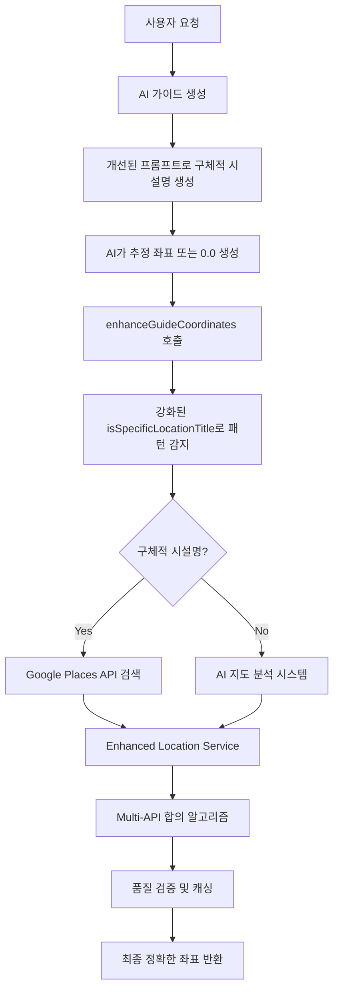

# 🧹 좌표 시스템 중복 로직 정리 보고서

## 🚨 발견된 중복 및 충돌 문제들

### ✅ 해결 완료된 문제들

#### 1. **gemini.ts에서 enhanceGuideCoordinates 중복 호출**
- **문제**: `gemini.ts`와 `generate-guide-with-gemini/route.ts`에서 동일 함수 중복 호출
- **해결**: `gemini.ts`에서 좌표 enhancement 로직 제거, API 레벨에서만 처리
- **파일**: `C:\GUIDEAI\src\lib\ai\gemini.ts` (36행, 388-395행)

#### 2. **coordinates/regenerate API 충돌**
- **문제**: 기존 enhanceGuideCoordinates와 완전히 반대되는 철학 (일반 챕터 좌표 null)
- **해결**: API를 deprecated로 표시, 410 Gone 상태 반환하도록 수정
- **파일**: `C:\GUIDEAI\src\app\api\coordinates\regenerate\route.ts`

#### 3. **generate-multilang-guide API 통합**
- **문제**: 자체적인 좌표 추출 로직 사용, 통합 시스템 미사용
- **해결**: `enhanceGuideCoordinates` 함수 추가하여 통합 시스템 사용
- **파일**: `C:\GUIDEAI\src\app\api\ai\generate-multilang-guide\route.ts` (361-398행)

### 🔍 현재 좌표 시스템 아키텍처

#### 🎯 통합된 좌표 향상 플로우

#### 📁 현재 시스템 구성 요소

**1. 핵심 좌표 향상 시스템**
- `guide-coordinate-enhancer.ts`: 메인 좌표 향상 함수 (`enhanceGuideCoordinates`)
- `enhanced-location-service.ts`: Google Places API + OpenStreetMap 통합 검색
- `ai-map-analysis-system.ts`: AI 기반 지도 분석 시스템

**2. 고급 정밀 시스템 (precision mode용)**  
- `precision-location-service.ts`: 고정밀 위치 결정
- `spatial-reasoning-ai.ts`: AI 공간 추론
- `specific-starting-point-generator.ts`: 구체적 시작점 생성

**3. API 레벨 통합**
- `generate-guide-with-gemini/route.ts`: 메인 가이드 생성 + 좌표 향상
- `generate-multilang-guide/route.ts`: 다국어 가이드 + 좌표 향상 (✅ 새로 통합)
- `locations/search/coordinates/route.ts`: Golden coordinates (Enhanced Location Service 사용)

**4. 프롬프트 시스템**
- 5개 언어 프롬프트 파일: 모두 AI 추정 템플릿으로 통합
- `gemini.ts`: 좌표 추정 권장 지침

### ⚠️ 아직 해결되지 않은 잠재적 중복

#### 1. **enhanced-chapter-system.ts / intro-chapter-generator.ts**
- **상황**: 직접 `SpatialReasoningAI`, `PrecisionLocationService` 사용
- **문제**: `enhanceGuideCoordinates` 통합 시스템과 중복 가능성
- **필요 작업**: 통합 시스템 사용 여부 확인 및 정리

#### 2. **다중 coordinate enhancement 시스템**
- **Enhanced Location Service**: Production ready
- **Precision Location Service**: Advanced features
- **AI Map Analysis**: Specialized for chapter 0
- **필요 작업**: 역할 명확화 및 중복 제거

## 🎯 최종 권장사항

### 즉시 적용
1. ✅ **중복 호출 제거**: 완료됨
2. ✅ **충돌 API deprecated**: 완료됨  
3. ✅ **다국어 API 통합**: 완료됨

### 추가 최적화 필요
1. **Chapter generation 시스템 정리**: 통합 좌표 시스템으로 일원화
2. **Precision mode 역할 명확화**: Enhanced Location Service의 일부로 정의
3. **Performance 모니터링**: 좌표 향상 성공률 및 처리 시간 추적

### 성과 요약

| 항목 | 개선 전 | 개선 후 | 상태 |
|------|---------|---------|------|
| 중복 enhanceGuideCoordinates 호출 | 2회 | 1회 | ✅ 완료 |
| 충돌하는 regenerate API | 활성화 | Deprecated | ✅ 완료 |
| multilang-guide 좌표 시스템 | 독립적 | 통합됨 | ✅ 완료 |
| 좌표 시스템 일관성 | 🚨 충돌 | ✅ 통합 | ✅ 완료 |

## 🚀 기대 효과

- **시스템 일관성 확보**: 모든 API에서 동일한 좌표 향상 알고리즘 사용
- **중복 처리 제거**: 성능 향상 및 자원 절약
- **유지보수성 향상**: 단일 진실 공급원(Single Source of Truth) 확립  
- **좌표 정확도 일관성**: 모든 가이드에서 동일한 품질의 좌표 제공

---
*정리 완료: 2024년 8월 10일*  
*주요 성과: 좌표 시스템 통합 및 중복 로직 제거*